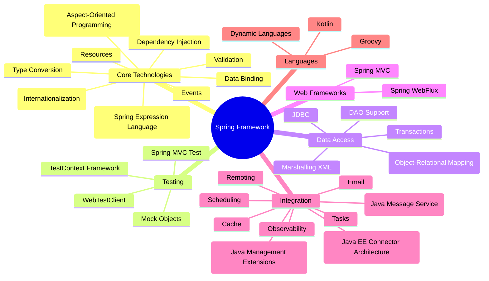

The Spring Framework is a powerful, feature-rich framework for building Java applications. It offers a comprehensive infrastructure to support the development of robust, maintainable, and scalable applications. This blog post provides an overview of the key components and features of the Spring Framework, giving you a clear understanding of its capabilities and benefits.

To visualize the structure and components of the Spring Framework, here's a detailed mind map:

## Core Technologies

### Dependency Injection
At the heart of the Spring Framework is the principle of Dependency Injection (DI). DI allows developers to build loosely coupled applications by injecting dependencies into objects rather than creating them within the objects. This is managed by the Spring container, which uses configuration metadata to manage object creation and wiring.

### Events
Spring's event mechanism is based on the observer design pattern, enabling beans to communicate with each other without being tightly coupled. Events can be published and listened to, allowing for a flexible, event-driven architecture.

### Resources
Spring provides a consistent way to access resources such as files, URLs, and classpath resources. The `Resource` interface abstracts the underlying resource retrieval mechanisms, making it easy to switch between different resource types.

### i18n (Internationalization)
Spring supports internationalization (i18n) to help developers create applications that can adapt to different languages and regions. This includes message source handling and locale resolution.

### Validation
Spring offers a robust validation framework that can be used to validate objects. It supports both built-in and custom validators, enabling comprehensive data integrity checks throughout the application.

### Data Binding
Data binding in Spring allows for automatic binding of form data to Java objects, simplifying the handling of web forms. This is particularly useful in web applications, where form data needs to be converted into domain objects.

### Type Conversion
Spring's type conversion system ensures that data can be converted between different types seamlessly. This is used extensively in data binding, SpEL, and other areas where type conversion is necessary.

### SpEL (Spring Expression Language)
SpEL is a powerful expression language used to query and manipulate objects at runtime. It allows for dynamic behavior in Spring applications, such as conditional configuration and dynamic bean definitions.

### AOP (Aspect-Oriented Programming)
AOP helps separate cross-cutting concerns such as logging, security, and transaction management from the business logic. This promotes cleaner code and better separation of concerns by allowing these concerns to be modularized.

## Testing

### Mock Objects
Spring's testing support includes mock objects to simulate real components. This allows developers to test individual parts of the application in isolation, ensuring that each component works correctly.

### TestContext Framework
The TestContext framework integrates Spring with popular testing frameworks like JUnit and TestNG. It provides comprehensive support for loading application contexts, dependency injection, and transaction management in tests.

### Spring MVC Test
Spring MVC Test allows for thorough testing of Spring MVC controllers without needing to deploy them to a server. This includes testing request mappings, model attributes, and view resolutions.

### WebTestClient
WebTestClient is used for testing WebFlux applications. It provides a fluent API for making requests and asserting responses, supporting both synchronous and asynchronous testing.

## Data Access

### Transactions
Spring's transaction management framework supports both declarative and programmatic transaction management. This ensures data consistency and integrity by coordinating transactions across multiple resources.

### DAO Support
Spring provides support for Data Access Objects (DAOs), which abstract the underlying data access code. This simplifies data access logic and promotes a clean separation of concerns.

### JDBC
Spring's JDBC framework simplifies database access by reducing boilerplate code. It provides a consistent way to handle database operations, error handling, and transaction management.

### ORM (Object-Relational Mapping)
Spring supports integration with ORM frameworks like Hibernate, JPA, and MyBatis. This makes it easier to manage database interactions by mapping Java objects to database tables.

### Marshalling XML
Spring's OXM (Object/XML Mapping) module supports marshalling and unmarshalling XML to and from Java objects. This facilitates XML processing, making it easier to work with XML data in Spring applications.

## Web Frameworks

### Spring MVC
Spring MVC is a robust framework for building web applications. It provides a flexible and powerful way to handle web requests and responses, including support for RESTful web services, form handling, and view resolution.

### Spring WebFlux
Spring WebFlux is designed for building reactive web applications. It supports non-blocking I/O and scalable concurrency, making it suitable for high-performance, event-driven applications.

## Integration

### Remoting
Spring's remoting support allows for the invocation of remote services. This facilitates distributed computing by providing various remoting technologies like RMI, Hessian, and HTTP Invoker.

### JMS (Java Message Service)
Spring's JMS integration simplifies the use of message-oriented middleware. It provides a consistent way to send and receive messages, enabling asynchronous communication between components.

### JCA (Java EE Connector Architecture)
Spring supports JCA for integrating with enterprise information systems. This provides a standard way to connect to legacy systems, ensuring interoperability and consistency.

### JMX (Java Management Extensions)
Spring's JMX support allows for the management and monitoring of applications. This improves maintainability and visibility by providing a way to expose and manage application resources.

### Email
Spring's email support simplifies sending and receiving emails. It abstracts the underlying email protocols, making it easy to integrate email functionality into applications.

### Tasks
Spring provides comprehensive support for task scheduling and asynchronous execution. This improves application performance and responsiveness by offloading time-consuming tasks to background threads.

### Scheduling
Spring's scheduling support allows for the execution of tasks at specified intervals. This enables the automation of repetitive tasks, such as batch processing and periodic data synchronization.

### Cache
Spring's caching abstraction simplifies the use of caching in applications. It provides a consistent API for various caching providers, improving performance and scalability.

### Observability
Spring provides tools for monitoring and observing application behavior. This ensures high availability and performance by providing insights into application health and performance metrics.

## Languages

### Kotlin
Spring has first-class support for Kotlin. This enables developers to leverage Kotlin's modern language features, such as null safety and extension functions, in Spring applications.

### Groovy
Spring's Groovy support allows for the use of Groovy scripts and DSLs (Domain-Specific Languages). This promotes dynamic and flexible code, making it easier to adapt to changing requirements.

### Dynamic Languages
Spring's dynamic language support extends to other JVM languages. This enables developers to choose the best language for their needs, promoting flexibility and innovation.

## Conclusion

The Spring Framework is an incredibly versatile and comprehensive framework for building Java applications. Its rich set of features and robust ecosystem make it a popular choice among developers for creating high-performance, scalable, and maintainable applications. Whether you are working on web applications, data access, or integration projects, Spring provides the tools and support you need to succeed.

